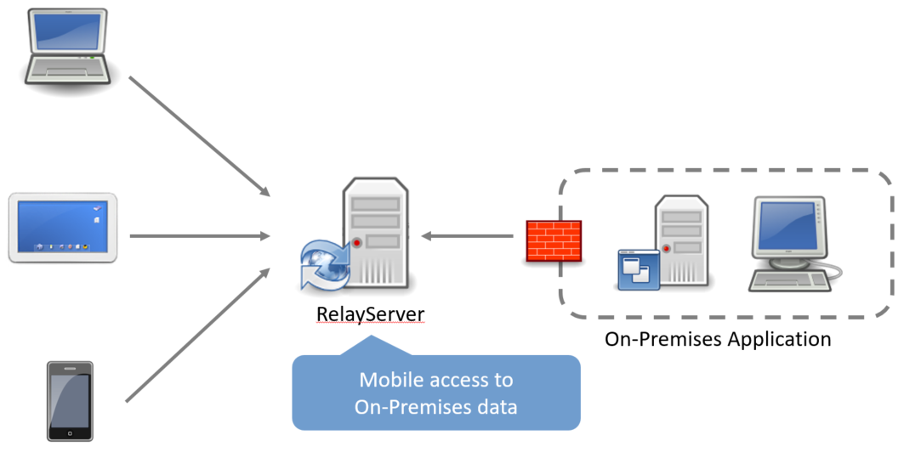

# [What is Thinktecture RelayServer?](1-what-is-thinktecture-relayserver.md)

The Thinktecture RelayServer (referred to as RelayServer in the following) provides open-source software for bi-directional, secure communication between clients, mobile devices and applications with on-premise applications behind routers and firewalls via the HTTPS protocol with complete centralized control and auditing of the allowed Participant and the permitted data.

A server that is equally available for client applications and on-premise applications is a secure exchange point for messages and data. Since the server is under the full control of the operator and uses encryption to communicate with both clients and on-premises applications, the security of the transmitted data is ensured at all times.

The positioning of the RelayServer in the public Internet also ensures that both clients and on-premise applications only need to establish outgoing connections to the RelayServer. Thus, neither firewalls, routers or NAT systems impose a problem, nor frequently changing IP addresses of DSL or mobile connections.

# Advantages of the RelayServer

- Open Source Software
- Full data ownership lies with the operator of the relay server
- Easy to implement as a pure software solution
- No libraries are required for the client software
- The solution supports multi-tenancy so that data can flow through a RelayServer for several different on-premise applications and their clients
- Firewalls, NAT and proxies are usually not a problem
- The transport channel is encrypted via HTTPS
- The On-Premises application requires an open outgoing HTTPS connection as a minimum requirement
- No special hardware required
- No firewall changes required
- No data retention in a DMZ is necessary

# Objective of the relay server

The requirements for enterprise applications have changed dramatically in recent years. The existing application environments consisting of servers and desktop-based clients in a local, secure network no longer reflect the current reality.

Companies and users demand concrete answers to these essential challenges from their solution providers:

## Challenge: Secure mobile data access

 
Mobile devices such as laptops, tablets and smartphones are an integral part of everyday business life. When accessing company data via such devices, the desire to no longer be bound to the local network is quickly created. The existing boundaries of the network must therefore be "transparent" without jeopardizing the security of company data.

The RelayServer supports secure connections of mobile devices with On-Premises applications purely on the basis of software. The On-Premises Server can be connected to the Internet via a simple dynamic DSL uplink or a 3G connection.

## Challenge: Connecting locations

Today, companies do not only exist in one place, but they are spread over many locations in the form of subsidiaries or branches. This spatial distribution results in the need for effective data networking, so that all sites can work together with the same company data.

The RelayServer ensures a fast and uncomplicated networking of the sites and seamlessly integrates itself into the application to be connected. Again, the On-Premises Server can be connected to the Internet via a simple dynamic DSL uplink or a 3G connection.

# Competing solutions for the RelayServer

## Open firewall ports

To access on-premises applications, a corresponding port can be opened in the corporate firewall. Accessing clients should then authorize the On-Premises application or the firewall via appropriate certificates to enable secure communication

Disadvantage:

1. Firewall must be accessible via a static IP, an official DNS entry or a DynDNS entry.
1. On-Premises application or the firewall must support the authorization of accessing clients with certificates.
1. Certificates must be regularly updated and then distributed to the client devices, which means high logistical effort.
1. Certificate management on devices increases support costs and makes it difficult for users to concentrate on their actual work.
1. The necessary firewall configurations can only be carried out by trained personnel.

## VPN

Virtual private networks (VPNs) generally allow secure communication between mobile clients and on-premises applications through the creation of secure virtual networks.

Disadvantage:

1. In front of each On-Premises Server, a VPN gateway is required, to which the VPN clients connects. These gateways often mean larger investments that have an impact on the IT budget of the company.
1. For the establishment and administration of VPN gateways, professionally trained personnel is necessary.
1. VPNs are often combined with the release of corresponding ports - as shown under "Open firewall ports". This creates an extremely complex and cost-intensive setup
1. The devices of the clients must support the establishment of VPN connections; a special VPN software must often be installed, configured and kept up-to-date.
1. The acceptance of VPNs by users is not particularly pronounced since the successful establishment of VPN connections is often experienced as problematic and complicated.

## Cloud Services

Cloud services enable clients and on-premise applications to be easily connected through the use of appropriate software libraries. But here, too, there are some disadvantages:

The use of the cloud as a relay point can be in conflict with the Federal Data Protection Act (Bundesdatenschutzgesetz, BDSG), depending on the location of the cloud provider and target sector of the application. Encryption of message transport with SSL also does not help because for message processing in the cloud the previously protected SSL encryption needs to be decrypted on machines that are not under direct control.

Cloud services often also offer only a minimal set of features and do not consider the different requirements of companies. Individual adjustments are generally not planned.
