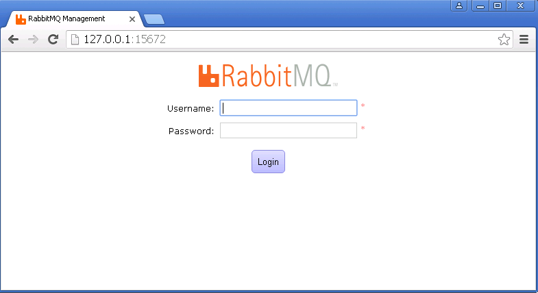
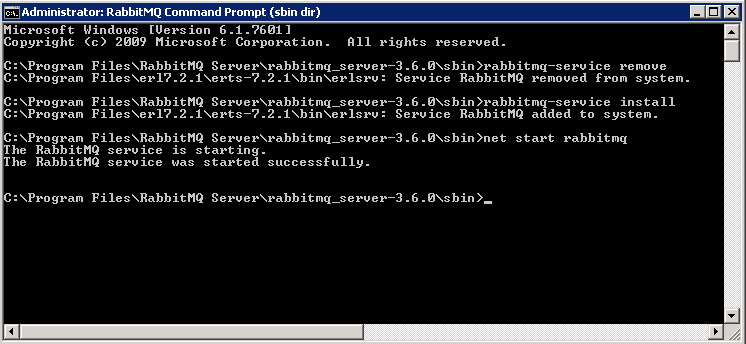
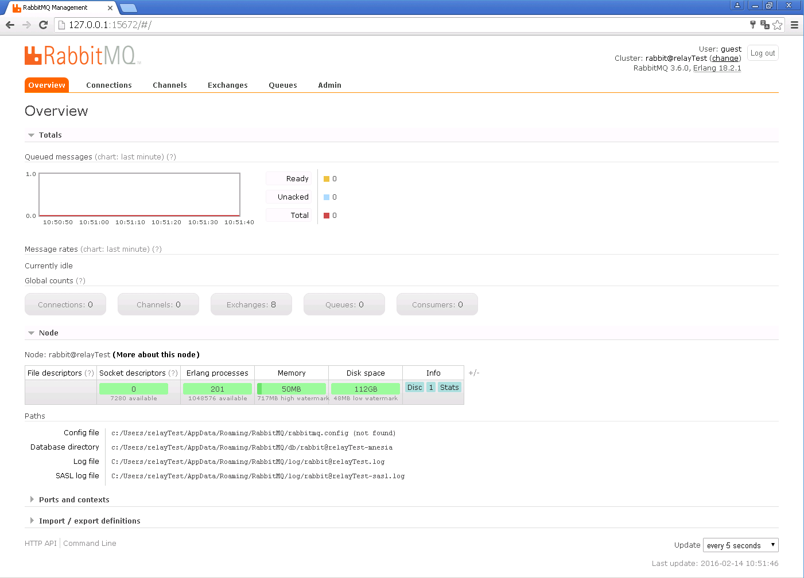

# Installation of RelayServer

## Requirements

The following software components must be installed on the Windows Server used for the operation of the RelayServer:

- Microsoft .Net Framework v4.5.1 or later
- Microsoft SQL Server (Express) 2014
- RabbitMQ with Erlang execution environment

### RabbitMQ with Erlang execution environment

The installation of RabbitMQ, which requires an installed Erlang execution environment, is detailed at [http://www.rabbitmq.com/install-windows.html](http://www.rabbitmq.com/install-windows.html) described. No deviating ports should be selected to avoid inconsistencies during the installation of the relay server.

After the installation of Erlang and RabbitMQ, it is useful to activate the management web interface for RabbitMQ. Activation takes place in the RabbitMQ Command Prompt, which has been created by installing RabbitMQ in the program group of the same name in the Start menu. Please start with administrator rights. In the RabbitMQ Command Prompt, the following commands must be executed:

```
rabbitmq-plugins enable rabbitmq_management
rabbitmq-service stop
rabbitmq-service start
```


Now the web management of RabbitMQ can be found at [http://127.0.0.1:15672/](http://127.0.0.1:15672/) where you can login.



**Note**: If the RabbitMQ web management interface is not accessible, the associated service is probably not installed correctly during the installation of RabbitMQ. To do this, you must check whether the RabbitMQ service contains a description in the Windows service console. If the service description is missing as in the screenshot below, the RabbitMQ installer was not able to install the service correctly.


In this case, the service must be manually uninstalled and reinstalled. The RabbitMQ Command Prompt is started as an administrator and the following commands are executed:

```
rabbitmq-service remove
rabbitmq-service install
net start rabbitmq
```



After this correction, the service with description should be present in the Windows service console and the Web Management should be available.

The default login data `guest / guest` is used to log in and RabbitMQ's status overview is displayed.



## Installation

The easiest way to install the RelayServer is by using the ready-made ZIP package from GitHub

```
https://github.com/thinktecture/relayserver/releases
```


The Zip package can be unpacked in the folder provided for the RelayServer. The folder must now be assigned rights for the Network Service via Windows Explorer / Properties Full Control. This is necessary for RelayServer to be started in this folder as a Windows service.

In a command line window with administrator rights, change to the created folder and install the RelayServer as a Windows service using the following command:

```
Thinktecture.Relay.Server.exe install
```

If desired, the Windows Service Name as well as the Windows Service Display Name can be customized by additional, optional command line arguments:

```
-servicename=ServiceName
-displayname=DisplayName
```

By default, the installation routine uses the name "TTRelayServer." The installation configures the RelayServer service to start automatically when Windows starts.

Before the first start of the currently installed RelayServer should be configured appropriately. Please refer to the next sections.

The RelayServer can be started either from the Windows service management console or via the still open command line:

```
Thinktecture.Relay.Server.exe start -servicename=ServiceName
```

The parameter "-servicename" is necessary if there are several RelayServers installed on the system.

## Uninstallation

To remove the RelayServer service, navigate to the folder of the RelayServer in a command line window with administrator rights and call this command:

```
Thinktecture.Relay.Server.exe uninstall
```

# Configuration of the relay server

The RelayServer is configured via the Thinktecture.Relay.Server.exe.config in the RelayServer folder. Any text editor (e.g. notepad) can be used to edit this file. The use of the sample configuration is recommended as a starting point

```
SAMPLE_Thinktecture.Relay.Server.exe.config
```


This configuration file should be saved as

```
Thinktecture.Relay.Server.exe.config
```

## Connection Strings

The connections of the RelayServer to the RabbitMQ and Microsoft SQL Server tools are configured in the <connectionStrings></ connectionStrings> section of the configuration file. By default, this section contains these two connection settings:

```
<add name="RabbitMQ" connectionString="host=localhost" />
<add name="RelayContext" connectionString="Server=.\SQLEXPRESS;Trusted\_Connection=True;Database=RelayServer" providerName="System.Data.SqlClient" />
```

If no changes to settings were made during the installation of RabbitMQ and Microsoft SQL Server, then these connection settings are sufficient. Otherwise, the settings must be adapted to the changed settings of RabbitMQ or Microsoft SQL Server (other ports or separate server for RabbitMQ or Microsoft SQL Server).

## Settings

The RelayServer is configured in the section

```
<appSettings></appSettings>
```

The default settings include:

```
<appSettings>
    <add key="EnableManagementWeb" value="true"/>
    <add key="ManagementWebLocation" value="ManagementWeb">
    <add key="EnableRelaying" value="true"/>
    <add key="EnableOnPremiseConnections" value="true" />
    <add key="Port" value="443"/>
    <add key="HostName" value="+"/>
    <add key="UseInsecureHttp" value="false" />
    <add key="ActiveConnectionTimeoutInSeconds" value="120" />
    <add key=PluginAssembly" value="" />
</appSettings>
```

|  Key name | Description |
| --- | --- |
| EnableManagementWeb | Enables the management web interface (default true) <br/> Possible values: true (on), false (off), local (only localhost requests are answered)
| ManagementWebLocation | Path to the files of the management web (default 'ManagementWeb') |
| EnableRelaying | Activates the relay function of the server (default true) <br/> Possible values: true (on), false (off), local (only localhost requests are answered)|
| EnableOnPremiseConnections | Allows the connection set-up of On-Premises connectors (default true) <br/> Possible values: true (on), false (off), local (only localhost requests are answered)|
| Port | Default port of the RelayServer (default 443) |
| HostName | Desired destination URL of RelayServer (default +) |
| UseInsecureHttp | Enables the use of HTTP instead of HTTPS (the use of HTTP in productive mode is not recommended). |
| TemporaryRequestStoragePath | Path to a directory where the data of the requests are temporarily stored. In multi-server mode this directory must be readable and described by all nodes. If no value is specified (default), the requests are kept in memory, and no multi-server operation is possible. |
| ActiveConnectionTimeoutInSeconds | Time after which a connection between an OnPremise Connector and the RelayServer is no longer active (default 120 seconds) |
| PluginAssembly | Path to an assembly that implements plugins. Either absolutely or relative to the RelayServer. |

## netsh settings

### Configuring the URL ACL

To operate the RelayServer with an HTTPS connection, a URL ACL must be set up in the local Windows configuration. To do this, you must run this command from a command line with administrator privileges:

```
netsh http add urlacl https://+:443/ user="NETWORK SERVICE"
```

It may be necessary to set the port to a value other than 443 if the default values have already been changed or the port on the Windows server is already in use.

If instead of an HTTPS connection a normal and thus unsecured http connection is desired, then the attribute AllowInsecureHttp must be activated in the configuration of the RelayServer.

### Configuration of SSL

The configuration of SSL is necessary if the RelayServer sahould handle its traffic via secure HTTPS connections. The use of HTTPS is the default value and is strongly recommended.

To install an SSL certificate, you must start the Microsoft Management Console:

```
run -> mmc
```

1. On the File menu, click Add / Remove Snap-in.
1. In the Add / Remove Snap-In dialog box, click Add.
1. In the Add Standalone Snap-in dialog box, click Certificates, and then click Add.
1. In the Certificate Snap-in dialog box, click Computer Account, and then click Next.
1. In the Select Computer dialog box, click Local Computer: (the computer that is running this console), and then click Finish.
1. In the Add Standalone Snap-in dialog box, click Close.
1. In the Add / Remove Snap-In dialog box, click OK.
1. In the left pane of the console, double-click Certificates (local computer).
1. Personal Store, point to All Tasks, and then click Import.
1. On the Welcome to the wizard page, click Next.
1. On the Import File Name page, click Browse, locate the certificate file, and then click Next.
1. If the certificate has a password, type the password on the page, and then click Next.
1. On the Certificate Store page, click Save All Certificates in the following store, and then click Next.
1. Click Finish, and then click OK to confirm that the import was successful.

The following command must be executed via a command line window with administration rights:

```
netsh http add sslcert ipport=0.0.0.0:443 certhash=thumbprint appid={guid}
```

It must be ensured that the port corresponds to the port from the configuration file of the RelayServer. The thumbprint must be replaced with the thumbprint from the SSL configuration. The GUID parameter must be replaced with a random GUID (for example, from https://www.guidgenerator.com/).

## Firewall Configuration

If the RelayServer is to be accessible for clients and on-premises applications without restrictions, then the Windows firewall must be enabled for the previously configured ports.

## SQL Server Configuration

You will need to add a login for SQL Server. Open SQL Server Management Studio (SSMS), connect to your SQL Server you want to use for RelayServer (and you have configured as connection string).

## Database

Right click Database and select New Database.... Use database name RelayServer if you didn't change it in your connection string.

## Login

Go to Security, right click Logins and select New login.

Since RelayServer uses a trusted connection to connect to SQL Server and runs as Network Service per default, you will need to add Network Service as a login. Select Windows authentication and click on Search. Type in Network Service and click Ok.

Side note: You don't have to use a trusted connection. You can use a SQL Server authenticated login, if you want. Don't forget to change the connection string!

Click on User Mapping in the left list. Check Map in the row of the database you just created. Then select db\_owner and click Ok.

# Installing the On-Premises Connector

## Requirements

The following software components must be installed on the Windows Server used for the operation of the RelayServer:

- Microsoft .Net Framework v4.5.1 or later
- Access to the service endpoints of the On-Premises application to be covered
- Outgoing https access to the URL of the RelayServer

## Installation

In typical deployment scenarios of the RelayServer, the On-Premises Connector is closely linked to the On-Premises application. The On-Premises Connector is therefore usually installed by the installer of the On-Premises application. The On-Premises Connector can also be installed separately for test setups.

## Configure the On-Premises Connector

To configure the On-Premises Connector, open the Thinktecture.Relay.OnPremiseConnector.exe.config configuration file in the installation folder (default: C:\Program Files\Thinktecture\On-Premises Connector) of the On-Premises Connector in any editor.

Only the <relayServer></ relayServer> section has to be edited in the configuration file:

```
<relayServer baseUrl="https://relay.company.example/" ignoreSslErrors="false" timeout="00:00:30" >
  <security authenticationType="Identity">
    <identity userName="userName" password="password" />
  </security>
  <onPremiseTargets>
    <web key="Test" baseUrl="http://localhost/" />
  </onPremiseTargets>
</relayServer>
```

### relayServer Element

|  Attribute | Description |
| --- | --- |
| baseUrl | RelayServer URL |
| ignoreSslErrors | Accepts responses of the on-premises application with a self-signed ssl certificate |
| timeout | Timeout, after which requests to the on-premises application will be aborted |

### security Element

|  Attribute | Description |
| --- | --- |
| authenticationType | In the current version of the RelayServer only the mode *Identity* is supported|

### identity Element

|  Attribute | Description |
| --- | --- |
| userName | Name of Link |
| password | Link password |

### onPremiseTargets Element

List of On-Premises Applications that the On-Premises Connector should be able to send requests to.
